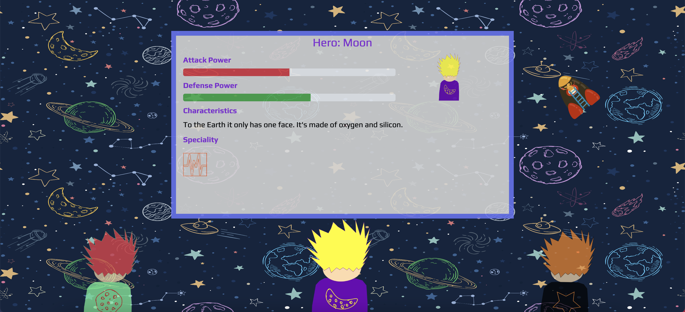

# About The Project

The Universe is at Risk. Choose a hero to fight the good fight. May the force be with you. Built with React.

[Live Project](https://spaceheroesmtfbwy.netlify.app/)



My goal with this project was to get deeper in CSS and learn/apply more CSS properties such as: positions (absolute, relative), animations, and try to be a little bit more creative in my projects. The most challenging parts with CSS was to have the "infinite" background, the little rocket flying around and have everything be responsible (It works in mobile too).

I also wanted to practice more React, I did everything with class components (States, Props) and kept all the heroes' data in a JSON file. The most challenging part of it was to make the Heroes "Selectable" and display their correct info on the Main Panel whenever one of them were selected. To make the "toggling" between them (keep just one selected, with an enhanced image) was also kind of tricky.

I did the heroes design (I know it's not that good haha but I like it) with Inkscape. The background image and the rocket I got from the internet.

After all, it was pretty fun and challenging :))).

# Set Up
## Clone this repo and install dependencies
```
git clone https://github.com/luisgcenci/SpaceHeroes.git
yarn install
```
## Run 
```
yarn start
```

